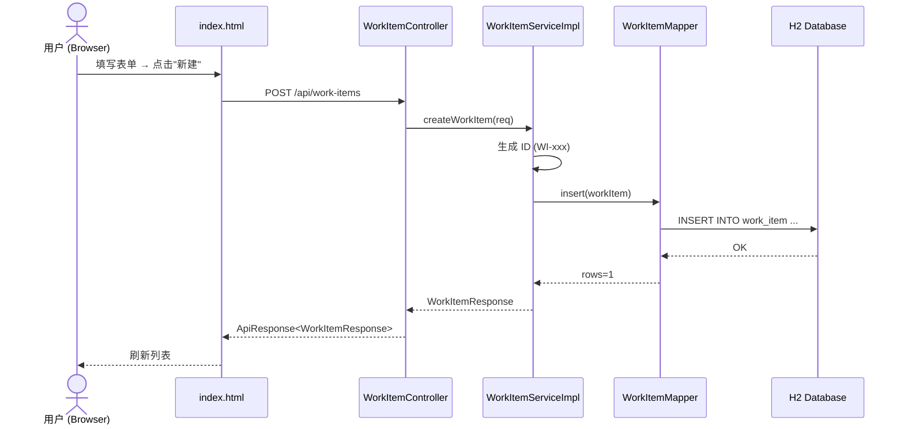
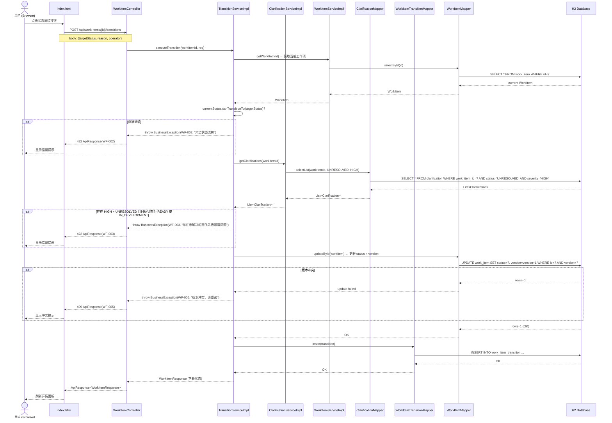
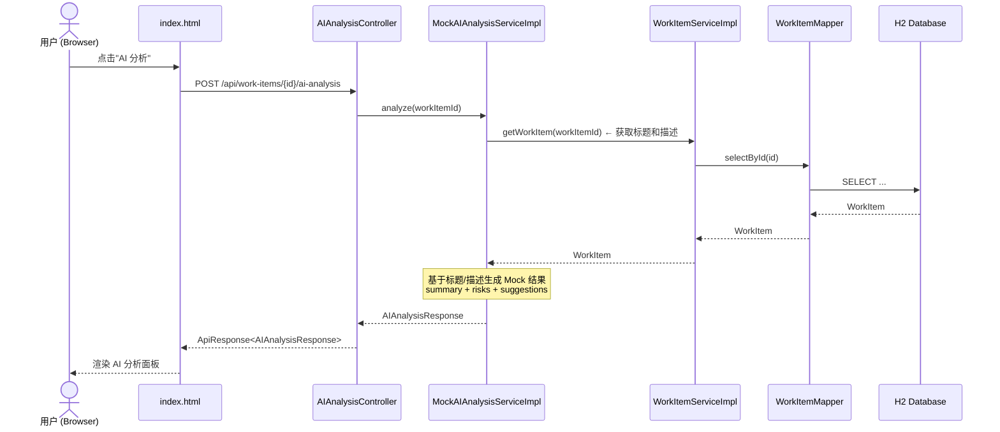
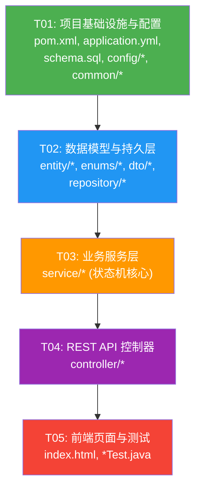

# ClariFlow — 技术架构设计文档

> 基于 PRD v1.0 | 作者：Bob (Architect) | 日期：2025-01-20

---

## Part A: 系统设计

### 1. 实现方案

#### 1.1 核心技术挑战

| 挑战 | 分析 |
|---|---|
| **状态机流转控制** | 6 种状态 + 多条正向/回退路径，需严格校验非法流转，返回明确错误码（422 + WF-002） |
| **业务规则拦截** | 存在 UNRESOLVED + HIGH 级 Clarification 时，禁止进入 READY / IN_DEVELOPMENT，需在 TransitionService 中做 AOP 式前置检查 |
| **JSON 字段存储** | `tags` 和 `acceptanceCriteria` 为 `List<String>`，在 H2 中以 VARCHAR 存储 JSON，通过 MyBatis-Plus TypeHandler 自动序列化/反序列化 |
| **乐观锁并发保护** | WorkItem 带 `version` 字段，更新时 MyBatis-Plus 自动做版本校验，冲突抛异常返回 WF-005 |
| **单页面前端** | 原生 HTML/CSS/JS，无构建工具，直接放在 `src/main/resources/static/`，Spring Boot 自动 serve |

#### 1.2 框架与库选型

| 技术点 | 选型 | 版本 | 理由 |
|---|---|---|---|
| 基础框架 | Spring Boot | 2.7.18 | 团队指定，Java 8 兼容 |
| ORM | MyBatis-Plus | 3.5.3.1 | 内置乐观锁、分页、TypeHandler 机制 |
| 数据库 | H2 | 2.1.214 | 内嵌模式，文件持久化（`jdbc:h2:file:./data/clariflow`），零依赖 |
| API 文档 | springdoc-openapi | 1.7.0 | 与 SB 2.7.x 兼容，OpenAPI 3.0 标准 |
| 简化代码 | Lombok | 1.18.30 | 减少样板代码 |
| JSON | Jackson | (SB 内置) | 序列化/反序列化 |
| 测试 | JUnit 5 + Mockito | (SB 内置) | 单元测试 + 集成测试 |
| 前端 | 原生 HTML/CSS/JS | — | 团队指定，Fetch API 调用后端 |

#### 1.3 架构模式

采用 **经典三层架构（Controller → Service → Mapper）**：

```
┌─────────────────────────────────────────────────────┐
│  Browser (index.html + Fetch API)                   │
├─────────────────────────────────────────────────────┤
│  Controller 层 (REST API, @RestController)          │
│  ├── WorkItemController                             │
│  ├── ClarificationController                        │
│  └── AIAnalysisController                           │
├─────────────────────────────────────────────────────┤
│  Service 层 (业务逻辑, @Service)                     │
│  ├── WorkItemServiceImpl                            │
│  ├── TransitionServiceImpl  ← 状态机核心             │
│  ├── ClarificationServiceImpl                       │
│  └── MockAIAnalysisServiceImpl                      │
├─────────────────────────────────────────────────────┤
│  Repository 层 (MyBatis-Plus Mapper)                 │
│  ├── WorkItemMapper                                 │
│  ├── WorkItemTransitionMapper                       │
│  └── ClarificationMapper                            │
├─────────────────────────────────────────────────────┤
│  H2 Database (file:./data/clariflow)                │
└─────────────────────────────────────────────────────┘
```

---

### 2. 文件列表

```
workitem-flow/
├── pom.xml
├── src/main/java/com/clariflow/workflow/
│   ├── ClariFlowApplication.java                    # Spring Boot 入口
│   ├── config/
│   │   ├── MyBatisPlusConfig.java                   # MyBatis-Plus 配置（分页插件、类型处理器注册）
│   │   ├── SwaggerConfig.java                       # OpenAPI 3.0 / Swagger 配置
│   │   └── WebConfig.java                           # CORS + 静态资源配置
│   ├── controller/
│   │   ├── WorkItemController.java                  # 工作项 CRUD + 状态流转
│   │   ├── ClarificationController.java             # 澄清问题 CRUD
│   │   └── AIAnalysisController.java                # AI 分析触发
│   ├── model/
│   │   ├── entity/
│   │   │   ├── WorkItem.java                        # 工作项实体
│   │   │   ├── WorkItemTransition.java             # 状态流转记录实体
│   │   │   └── Clarification.java                  # 澄清问题实体
│   │   ├── dto/
│   │   │   ├── request/
│   │   │   │   ├── WorkItemCreateRequest.java       # 创建工作项请求
│   │   │   │   ├── WorkItemUpdateRequest.java       # 更新工作项请求
│   │   │   │   ├── TransitionRequest.java           # 状态流转请求
│   │   │   │   ├── ClarificationCreateRequest.java  # 创建澄清问题请求
│   │   │   │   └── ClarificationResolveRequest.java # 解决澄清问题请求
│   │   │   └── response/
│   │   │       ├── ApiResponse.java                 # 统一响应体<T>
│   │   │       ├── WorkItemResponse.java            # 工作项详情响应
│   │   │       ├── WorkItemListItemResponse.java    # 工作项列表项响应
│   │   │       ├── TransitionResponse.java          # 状态流转记录响应
│   │   │       ├── ClarificationResponse.java       # 澄清问题响应
│   │   │       └── AIAnalysisResponse.java          # AI 分析结果响应
│   │   └── enums/
│   │       ├── WorkItemType.java                    # STORY / BUG / TASK
│   │       ├── Priority.java                        # P0 / P1 / P2
│   │       ├── WorkItemStatus.java                  # 状态 + 流转规则
│   │       ├── Severity.java                        # HIGH / MEDIUM / LOW
│   │       └── ClarificationStatus.java            # UNRESOLVED / RESOLVED
│   ├── repository/
│   │   ├── WorkItemMapper.java                      # MyBatis-Plus BaseMapper
│   │   ├── WorkItemTransitionMapper.java
│   │   └── ClarificationMapper.java
│   ├── service/
│   │   ├── WorkItemService.java                     # 工作项服务接口
│   │   ├── WorkItemServiceImpl.java                 # 工作项服务实现
│   │   ├── TransitionService.java                   # 状态流转服务接口
│   │   ├── TransitionServiceImpl.java               # 状态流转服务实现（状态机核心）
│   │   ├── ClarificationService.java                # 澄清问题服务接口
│   │   ├── ClarificationServiceImpl.java            # 澄清问题服务实现
│   │   ├── AIAnalysisService.java                   # AI 分析服务接口
│   │   └── MockAIAnalysisServiceImpl.java           # Mock AI 分析实现
│   └── common/
│       ├── exception/
│       │   ├── BusinessException.java               # 业务异常（携带 ErrorCode）
│       │   └── GlobalExceptionHandler.java          # @ControllerAdvice 全局异常处理
│       ├── ErrorCode.java                           # 统一错误码枚举
│       └── handler/
│           └── JsonListTypeHandler.java             # List<String> ↔ JSON 类型处理器
├── src/main/resources/
│   ├── application.yml                              # Spring Boot 配置
│   ├── schema.sql                                   # DDL 建表语句
│   ├── data.sql                                     # Seed Data (WI-001, WI-002)
│   └── static/
│       └── index.html                               # 单页面前端（内联 CSS/JS）
└── src/test/java/com/clariflow/workflow/
    ├── service/
    │   ├── TransitionServiceTest.java               # 状态流转核心测试
    │   └── ClarificationServiceTest.java            # 澄清问题 + 业务拦截规则测试
    └── controller/
        └── WorkItemControllerTest.java              # 工作项 API 集成测试
```

---

### 3. 数据结构和接口

#### 3.1 实体关系类图

```mermaid
classDiagram
    direction TB

    %% ── 枚举 ──
    class WorkItemType {
        <<enumeration>>
        STORY
        BUG
        TASK
    }
    class Priority {
        <<enumeration>>
        P0
        P1
        P2
    }
    class WorkItemStatus {
        <<enumeration>>
        DRAFT
        ANALYZING
        READY
        IN_DEVELOPMENT
        TESTING
        COMPLETED
        +canTransitionTo(WorkItemStatus target) boolean$
        +getAllowedTargets() List~WorkItemStatus~$
    }
    class Severity {
        <<enumeration>>
        HIGH
        MEDIUM
        LOW
    }
    class ClarificationStatus {
        <<enumeration>>
        UNRESOLVED
        RESOLVED
    }

    %% ── 数据库实体 ──
    class WorkItem {
        -String id
        -String title
        -String description
        -WorkItemType type
        -Priority priority
        -WorkItemStatus status
        -String assignee
        -List~String~ tags
        -List~String~ acceptanceCriteria
        -Severity riskLevel
        -Integer version
        -LocalDateTime createdAt
        -LocalDateTime updatedAt
    }

    class WorkItemTransition {
        -Long id
        -String workItemId
        -WorkItemStatus fromStatus
        -WorkItemStatus toStatus
        -String reason
        -String operator
        -LocalDateTime createdAt
    }

    class Clarification {
        -Long id
        -String workItemId
        -String question
        -Severity severity
        -ClarificationStatus status
        -String answer
        -LocalDateTime createdAt
        -LocalDateTime resolvedAt
    }

    %% ── 请求 DTO ──
    class WorkItemCreateRequest {
        +String title
        +String description
        +WorkItemType type
        +Priority priority
        +String assignee
        +List~String~ tags
        +List~String~ acceptanceCriteria
        +Severity riskLevel
    }

    class WorkItemUpdateRequest {
        +String title
        +String description
        +WorkItemType type
        +Priority priority
        +String assignee
        +List~String~ tags
        +List~String~ acceptanceCriteria
        +Severity riskLevel
        +Integer version
    }

    class TransitionRequest {
        +WorkItemStatus targetStatus
        +String reason
        +String operator
    }

    class ClarificationCreateRequest {
        +String question
        +Severity severity
    }

    class ClarificationResolveRequest {
        +String answer
    }

    %% ── 响应 DTO ──
    class ApiResponse~T~ {
        +Integer code
        +String message
        +T data
        +long timestamp
        +success(T data)$ ApiResponse~T~
        +error(Integer code, String message)$ ApiResponse~Void~
    }

    class WorkItemResponse {
        +String id
        +String title
        +String description
        +WorkItemType type
        +Priority priority
        +WorkItemStatus status
        +String assignee
        +List~String~ tags
        +List~String~ acceptanceCriteria
        +Severity riskLevel
        +Integer version
        +LocalDateTime createdAt
        +LocalDateTime updatedAt
        +List~ClarificationResponse~ clarifications
        +List~TransitionResponse~ transitions
        +AIAnalysisResponse aiAnalysis
    }

    class WorkItemListItemResponse {
        +String id
        +String title
        +WorkItemType type
        +Priority priority
        +WorkItemStatus status
        +String assignee
        +Severity riskLevel
        +LocalDateTime updatedAt
    }

    class TransitionResponse {
        +Long id
        +String workItemId
        +WorkItemStatus fromStatus
        +WorkItemStatus toStatus
        +String reason
        +String operator
        +LocalDateTime createdAt
    }

    class ClarificationResponse {
        +Long id
        +String workItemId
        +String question
        +Severity severity
        +ClarificationStatus status
        +String answer
        +LocalDateTime createdAt
        +LocalDateTime resolvedAt
    }

    class AIAnalysisResponse {
        +String summary
        +List~RiskItem~ risks
        +List~String~ suggestions
        +LocalDateTime analyzedAt
    }

    class RiskItem {
        +Severity level
        +String description
    }

    %% ── Service 接口 ──
    class WorkItemService {
        <<interface>>
        +createWorkItem(WorkItemCreateRequest req) WorkItemResponse
        +getWorkItem(String id) WorkItemResponse
        +listWorkItems(String type, String priority, String status) List~WorkItemListItemResponse~
        +updateWorkItem(String id, WorkItemUpdateRequest req) WorkItemResponse
    }

    class TransitionService {
        <<interface>>
        +executeTransition(String workItemId, TransitionRequest req) WorkItemResponse
        +getTransitionHistory(String workItemId) List~TransitionResponse~
    }

    class ClarificationService {
        <<interface>>
        +addClarification(String workItemId, ClarificationCreateRequest req) ClarificationResponse
        +getClarifications(String workItemId) List~ClarificationResponse~
        +resolveClarification(String workItemId, Long clarificationId, ClarificationResolveRequest req) ClarificationResponse
    }

    class AIAnalysisService {
        <<interface>>
        +analyze(String workItemId) AIAnalysisResponse
    }

    class MockAIAnalysisService {
        +analyze(String workItemId) AIAnalysisResponse
    }

    %% ── 关系 ──
    WorkItem --> WorkItemType : type
    WorkItem --> Priority : priority
    WorkItem --> WorkItemStatus : status
    WorkItem --> Severity : riskLevel
    WorkItemTransition --> WorkItemStatus : fromStatus, toStatus
    Clarification --> Severity : severity
    Clarification --> ClarificationStatus : status

    WorkItem "1" -- "0..*" WorkItemTransition : has history
    WorkItem "1" -- "0..*" Clarification : has clarifications

    WorkItemCreateRequest --> WorkItemType
    WorkItemCreateRequest --> Priority
    WorkItemCreateRequest --> Severity
    WorkItemUpdateRequest --> WorkItemType
    WorkItemUpdateRequest --> Priority
    WorkItemUpdateRequest --> Severity
    TransitionRequest --> WorkItemStatus
    ClarificationCreateRequest --> Severity

    WorkItemResponse --> WorkItemType
    WorkItemResponse --> Priority
    WorkItemResponse --> WorkItemStatus
    WorkItemResponse --> Severity
    WorkItemResponse *-- "0..*" ClarificationResponse
    WorkItemResponse *-- "0..*" TransitionResponse
    WorkItemResponse *-- "0..1" AIAnalysisResponse
    AIAnalysisResponse *-- "0..*" RiskItem
    RiskItem --> Severity

    AIAnalysisService <|.. MockAIAnalysisService : implements

    WorkItemService --> WorkItemResponse
    WorkItemService --> WorkItemListItemResponse
    TransitionService --> TransitionResponse
    ClarificationService --> ClarificationResponse
    AIAnalysisService --> AIAnalysisResponse
```



#### 3.2 WorkItemStatus 状态流转规则（关键设计）

```java
// 枚举内置流转规则 —— 单一真相源
public enum WorkItemStatus {
    DRAFT {
        @Override public List<WorkItemStatus> getAllowedTargets() {
            return Arrays.asList(ANALYZING);
        }
    },
    ANALYZING {
        @Override public List<WorkItemStatus> getAllowedTargets() {
            return Arrays.asList(READY, DRAFT);
        }
    },
    READY {
        @Override public List<WorkItemStatus> getAllowedTargets() {
            return Arrays.asList(IN_DEVELOPMENT, ANALYZING);
        }
    },
    IN_DEVELOPMENT {
        @Override public List<WorkItemStatus> getAllowedTargets() {
            return Arrays.asList(TESTING, READY);
        }
    },
    TESTING {
        @Override public List<WorkItemStatus> getAllowedTargets() {
            return Arrays.asList(COMPLETED, IN_DEVELOPMENT);
        }
    },
    COMPLETED {
        @Override public List<WorkItemStatus> getAllowedTargets() {
            return Arrays.asList(TESTING);
        }
    };

    public abstract List<WorkItemStatus> getAllowedTargets();

    public boolean canTransitionTo(WorkItemStatus target) {
        return getAllowedTargets().contains(target);
    }
}
```

---

### 4. 程序调用流程

#### 4.1 创建 WorkItem 并触发状态流转（核心流程）



#### 4.2 状态流转 + 业务规则拦截（关键流程）



#### 4.3 AI 分析流程



---

### 5. 待明确事项

| # | 问题 | 当前处理方式 |
|---|---|---|
| Q1 | WorkItem ID 生成策略 | **假设**：使用 `WI-` 前缀 + 自增编号（如 `WI-001`），在 Service 层生成。后续可切换为雪花 ID |
| Q2 | H2 控制台是否开启 | **假设**：开启 `/h2-console`，开发阶段便于调试 |
| Q3 | "负责人"字段是否需要独立用户表 | **假设**：MVP 用纯字符串，不建 User 表（PRD Q1 已确认） |
| Q4 | AI 分析触发方式 | **假设**：手动触发（PRD Q3 已确认） |
| Q5 | H2 持久化模式 | **假设**：文件模式 `jdbc:h2:file:./data/clariflow`（PRD Q4 已确认） |
| Q6 | 前端是否处理 409 乐观锁冲突 | **假设**：前端捕获 409，提示用户刷新重试 |
| Q7 | Tags/AcceptanceCriteria JSON 列长度上限 | **假设**：VARCHAR(4000)，足够容纳正常列表 |

---

## Part B: 任务分解

### 6. 依赖包列表

```xml
<!-- pom.xml 核心依赖 -->
<properties>
    <java.version>1.8</java.version>
    <spring-boot.version>2.7.18</spring-boot.version>
    <mybatis-plus.version>3.5.3.1</mybatis-plus.version>
    <springdoc.version>1.7.0</springdoc.version>
    <lombok.version>1.18.30</lombok.version>
    <h2.version>2.1.214</h2.version>
</properties>

<dependencies>
    <!-- Spring Boot Starters -->
    <dependency>
        <groupId>org.springframework.boot</groupId>
        <artifactId>spring-boot-starter-web</artifactId>
    </dependency>
    <dependency>
        <groupId>org.springframework.boot</groupId>
        <artifactId>spring-boot-starter-validation</artifactId>
    </dependency>

    <!-- MyBatis-Plus -->
    <dependency>
        <groupId>com.baomidou</groupId>
        <artifactId>mybatis-plus-boot-starter</artifactId>
        <version>${mybatis-plus.version}</version>
    </dependency>

    <!-- H2 Database -->
    <dependency>
        <groupId>com.h2database</groupId>
        <artifactId>h2</artifactId>
        <version>${h2.version}</version>
    </dependency>

    <!-- SpringDoc OpenAPI 3.0 -->
    <dependency>
        <groupId>org.springdoc</groupId>
        <artifactId>springdoc-openapi-ui</artifactId>
        <version>${springdoc.version}</version>
    </dependency>

    <!-- Lombok -->
    <dependency>
        <groupId>org.projectlombok</groupId>
        <artifactId>lombok</artifactId>
        <version>${lombok.version}</version>
        <scope>provided</scope>
    </dependency>

    <!-- Test -->
    <dependency>
        <groupId>org.springframework.boot</groupId>
        <artifactId>spring-boot-starter-test</artifactId>
        <scope>test</scope>
    </dependency>
    <dependency>
        <groupId>com.h2database</groupId>
        <artifactId>h2</artifactId>
        <scope>test</scope>
    </dependency>
</dependencies>
```

### 7. 任务列表（按依赖顺序）

| Task ID | 任务名称 | 源文件 | 依赖 | 优先级 |
|---|---|---|---|---|
| **T01** | 项目基础设施与配置 | `pom.xml`, `application.yml`, `schema.sql`, `data.sql`, `ClariFlowApplication.java`, `config/MyBatisPlusConfig.java`, `config/SwaggerConfig.java`, `config/WebConfig.java`, `common/exception/BusinessException.java`, `common/exception/GlobalExceptionHandler.java`, `common/ErrorCode.java`, `common/handler/JsonListTypeHandler.java` | — | P0 |
| **T02** | 数据模型与持久层 | `model/entity/WorkItem.java`, `model/entity/WorkItemTransition.java`, `model/entity/Clarification.java`, `model/enums/WorkItemType.java`, `model/enums/Priority.java`, `model/enums/WorkItemStatus.java`, `model/enums/Severity.java`, `model/enums/ClarificationStatus.java`, `model/dto/request/WorkItemCreateRequest.java`, `model/dto/request/WorkItemUpdateRequest.java`, `model/dto/request/TransitionRequest.java`, `model/dto/request/ClarificationCreateRequest.java`, `model/dto/request/ClarificationResolveRequest.java`, `model/dto/response/ApiResponse.java`, `model/dto/response/WorkItemResponse.java`, `model/dto/response/WorkItemListItemResponse.java`, `model/dto/response/TransitionResponse.java`, `model/dto/response/ClarificationResponse.java`, `model/dto/response/AIAnalysisResponse.java`, `repository/WorkItemMapper.java`, `repository/WorkItemTransitionMapper.java`, `repository/ClarificationMapper.java` | T01 | P0 |
| **T03** | 业务服务层（状态机核心） | `service/WorkItemService.java`, `service/WorkItemServiceImpl.java`, `service/TransitionService.java`, `service/TransitionServiceImpl.java`, `service/ClarificationService.java`, `service/ClarificationServiceImpl.java`, `service/AIAnalysisService.java`, `service/MockAIAnalysisServiceImpl.java` | T02 | P0 |
| **T04** | REST API 控制器 | `controller/WorkItemController.java`, `controller/ClarificationController.java`, `controller/AIAnalysisController.java` | T03 | P0 |
| **T05** | 前端页面与测试 | `src/main/resources/static/index.html`, `src/test/java/.../service/TransitionServiceTest.java`, `src/test/java/.../service/ClarificationServiceTest.java`, `src/test/java/.../controller/WorkItemControllerTest.java` | T04 | P1 |

> **总计 5 个任务，严格遵循上限。**

### 8. 共享知识（跨文件约定）

```
【API 响应格式】
所有接口统一使用 ApiResponse<T> 包装：
  - 成功: { "code": 0, "message": "success", "data": {...}, "timestamp": ... }
  - 失败: { "code": <错误码>, "message": "<错误描述>", "data": null, "timestamp": ... }
  - HTTP 状态码: 成功 200, 业务错误 422, 版本冲突 409, 资源不存在 404, 服务器错误 500

【统一错误码体系】
  ErrorCode 枚举定义:
    WF-001 (404): WORK_ITEM_NOT_FOUND     — 工作项不存在
    WF-002 (422): INVALID_TRANSITION       — 非法状态流转
    WF-003 (422): HIGH_CLARIFICATION_BLOCK — 存在未解决的高优先级澄清问题
    WF-004 (404): CLARIFICATION_NOT_FOUND  — 澄清问题不存在
    WF-005 (409): VERSION_CONFLICT         — 版本冲突，请重试

【数据库约定】
  - 表名: work_item, work_item_transition, clarification（蛇形命名）
  - 主键: work_item.id 为 VARCHAR(20)，其余为 BIGINT AUTO_INCREMENT
  - 时间: 所有时间字段使用 LocalDateTime，序列化为 ISO 8601 格式（Jackson 默认）
  - JSON 列: tags, acceptanceCriteria 存为 VARCHAR(4000) JSON 数组字符串
  - 乐观锁: work_item.version 初始值为 1，每次更新 +1
  - H2 连接: jdbc:h2:file:./data/clariflow;DB_CLOSE_DELAY=-1;MODE=MySQL

【实体约定】
  - 所有 Entity 使用 @TableName 指定表名
  - 使用 Lombok @Data @NoArgsConstructor @AllArgsConstructor
  - WorkItem 的 List<String> 字段使用 @TableField(typeHandler = JsonListTypeHandler.class)
  - Mapper 接口继承 BaseMapper<T>

【状态机约定】
  - 流转规则单一真相源：WorkItemStatus 枚举的 getAllowedTargets()
  - TransitionServiceImpl 先校验 → 再执行业务规则 → 更新状态 → 记录历史 → 全在同一个事务中
  - @Transactional 标注在 executeTransition() 上

【Service 层约定】
  - 接口定义在 service/ 目录，实现在同目录加 Impl 后缀
  - 所有"不存在"场景统一 throw BusinessException(ErrorCode.WF-001/WF-004, message)

【前端约定】
  - 单页面 index.html，内联 <style> 和 <script>
  - 使用 Fetch API，base URL: /api
  - 列表面板在左侧，详情面板在右侧（CSS Flexbox 两栏布局）
  - 状态流转按钮根据 WorkItemStatus.getAllowedTargets() 动态生成
  - AI 分析结果区域默认隐藏，点击按钮后展示

【测试约定】
  - TransitionServiceTest: 覆盖全部合法流转路径 + 全部非法流转拦截
  - ClarificationServiceTest: 覆盖 HIGH 级拦截规则
  - WorkItemControllerTest: @SpringBootTest + @AutoConfigureMockMvc 集成测试
  - 测试用 H2 内存模式: jdbc:h2:mem:testdb
```

### 9. 任务依赖图



> **依赖链**: T01 → T02 → T03 → T04 → T05，线性依赖，每步为下一步提供基础。

---

*文档版本：v1.0 | 作者：Bob (Architect) | 日期：2025-01-20*
